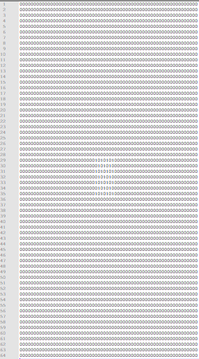
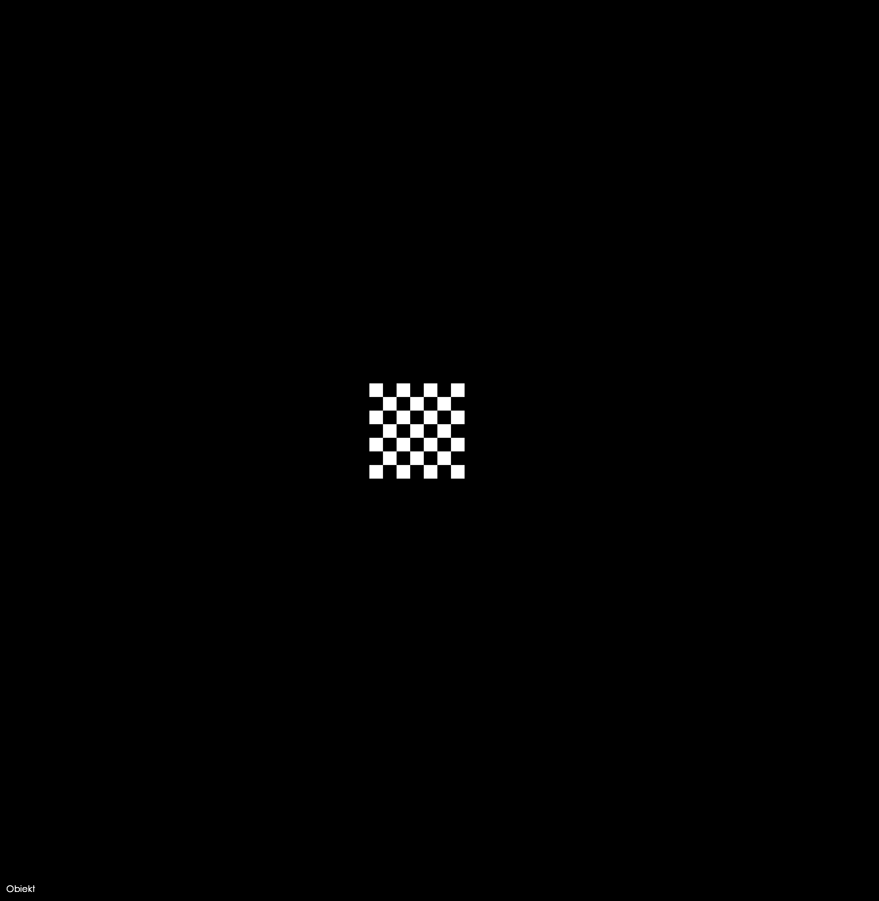
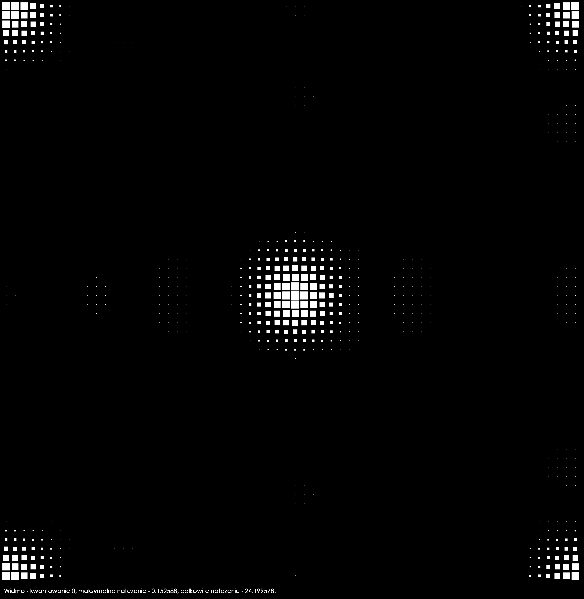
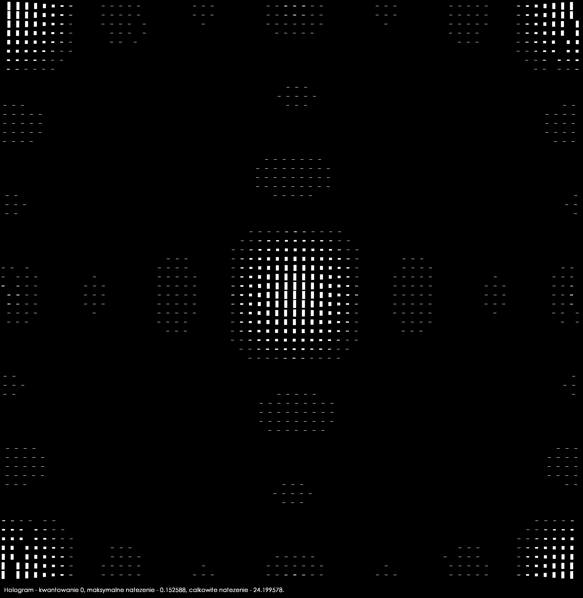
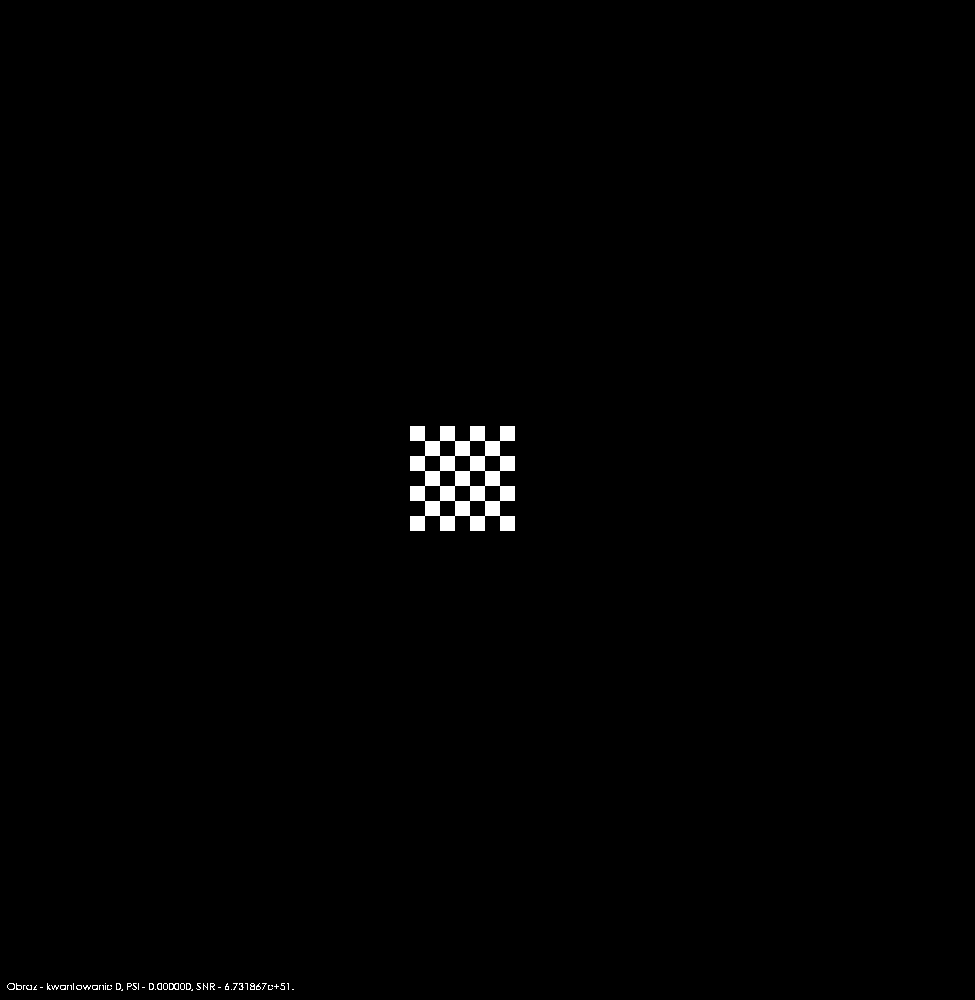

# CGH
What this program aims to do is to generate a hologram based on a binary 64x64 object, saved in a text file.
The program consists of a basic graphical UI, in which user can select options he wants and set the properties of generated images, like color and whether or not to generate a chart.

I utilized SFML libraries by SFML-Team (GitHub link - https://github.com/SFML/SFML) and some ugly textures I made myself, but plan to change them once I find some time. They are sort of placeholders as of now.

The output of the program are some .txt files, which contain data processed by the program. They are not really useful, but can prove so if you want to analyze the images generated by the program.
Staying on the topic of images - the program generates 4 images:
1. 'object.png' - the data on the input as a .png file. To be quick - the program reads data, translates the binary numbers to image and outputs it here.
2. 'spectrum.png' - data processed as a spectrum of an image. It is made by using Fast Fourier Transformation on the object.
3. 'hologram.png' - a spectrum but considering phase and amplitude. This is in fact the most important image, that can be projected. Plus it looks quite nice :)
4. 'image.png' - hologram that was processed once more, but the other way around, with the Fourier transformation - to put it simply. It shows how quantization impacts the result.

This was my school project for a contest, called "Olympics of Technical Innovation 2019". Of course the title is translated from Polish. I took the 2nd place in my region and didn't make it to the next stage, sadly, but for a beginner programmer it's a huge success that someone appreciated my efforts and wanted to work with me on making something I'd be proud of.

The Fast Fourier Transform (FFT) was prepared by my project coordinator - Krzysztof Łyszczek, who gave the idea and was the inspiration for all this mess. I have his permission to upload it here and I am really grateful for all the hard work he did to teach me about physics and how FFT, spectrums, imagery and optics in general work.

# Authors:
1. Adrian Tomicki - main developer and translator, beginner at coding, responsible for this mess of a code and the repository.
2. Krzysztof Łyszczek - project coordinator and manager, provided Fast Fourier Transform and theoretical knowledge of physics, optics and more.

# To do:
Update the graphical design of the UI and enhance the front-end side of the program. It looks poorly-made.

# From the author:

Thank you for reading this. It really means a lot to me. 

I'm an 18 y/o IT student of a technical high school in Szczecin, Poland.

I am still a beginner. Maybe I know some stuff, but I still have very, very much to learn. I wish to be a big-brained, hard-working, coffee-drinking programmer someday.

I spent about 4 months making this with my coordinator - Krzysztof Łyszczek, who I owe pretty much the fact that this program has become a thing. He gave the idea and directed the project to turn out what it currently is. We started at the beginning of January and spent several hours a week, sometimes after hours. And for those hours I want to thank him.

I also want to thank my programming teacher - Filip Majewski - who recommended me as a person suitable for making the project, and I hope I proved capable, just as he thought. To him I owe my first #include &lt;iostream&gt;, int main() and std::cout&lt;&lt;"Hello world!"&lt;&lt;std::endl;
  
Uhhh, I speak as if it was over. No, it's not. The project isn't perfect, and that's a fact. There's much work to do, and more to come.

# Sample images:
<ol type="1">
<li>An input file (64x64 made of binary numbers, stored in .txt files, chosen in the program): 
  </li> 
<li>Object, being a translation of the input file to a .png image: 
  </li>
<li>Spectrum, which is the object, transformed by FFT: 
  </li>
<li>Hologram (spectrum considering amplitude and phase): 
  </li>
<li>Image (hologram, transformed by a reversed FFT): 
  </li>
</ol>

Each image has a caption at the bottom, signalizing which one of the four it is.

Additionally, 'image.png' has PSI and SNR added to the caption. Those two vary depending on quantization level. Ideally, PSI goes lower (0 means that the object was reproduced as original) and SNR goes higher (numbers near-infinite mean that the object was reproduced with the highest accuracy).
